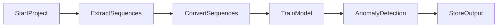

# ML 24/25-03 Implement Anomaly Detection Sample

# Introduction:

HTM (Hierarchical Temporal Memory) is a machine learning algorithm, which uses a hierarchical network of nodes to process time-series data in a distributed way. Each node, or column, can be trained to learn and recognize patterns in input data. This can be used in identifying anomalies/deviations from normal patterns. It is a promising approach for anomaly detection and prediction in a variety of applications. In our project, we are going to use the MultiSequenceLearning class in NeoCortex API to implement an anomaly detection system, such that numerical sequences are read from multiple CSV files inside a folder, train our HTM Engine, and use the trained engine for learning patterns and detect anomalies.  

# Requirements

To run this project, we need.
* [.NET 8.0 SDK](https://dotnet.microsoft.com/en-us/download/dotnet/8.0)
* Nuget package: [NeoCortexApi Version= 1.1.4](https://www.nuget.org/packages/NeoCortexApi/)

For code debugging, we recommend using Visual Studio IDE/Visual Studio Code. This project can be run on [github codespaces](https://github.com/features/codespaces) as well.

# Usage

To run this project, 

* Install .NET SDK. Then using the code editor/IDE of your choice, create a new console project and place all the C# codes inside your project folder. 
* Add/reference Nuget package NeoCortexApi v1.1.4 to this project.
* Place numerical sequence CSV Files (datasets) under relevant folders respectively. All the folders should be inside the project folder. More details are given below.

Our project is based on NeoCortex API. More details [here](https://github.com/ddobric/neocortexapi/blob/master/source/Documentation/gettingStarted.md).

# Working Process

Here is the working principle in a single graph to understand the steps to follow to execute and develop this project. [For more details click here]()



# Details

To train our HTM Engine, we used the [MultiSequenceLearning](https://github.com/ddobric/neocortexapi/blob/master/source/Samples/NeoCortexApiSample/MultisequenceLearning.cs) class in the NeoCortex API. Firstly, we will read and train the HTM Engine using the data from both our training (learning) and predicting (predictive) folders, which are present as numerical sequences in CSV files in the 'training' and 'predicting' folders inside the project directory. We will read numerical sequence data from the prediction folder for testing purposes, remove the first few elements (thus effectively turning the data into a subsequence of the original sequence; we have already inserted anomalies at random indexes into this data), and then use it to detect anomalies.

Please take note that all files inside the folders are read with the.csv extension, and exception handlers are set up in case the file format is incorrect.

We are employing artificial integer sequence data of network load for this project, which is saved inside of CSV files and is rounded off to the nearest integer, in percentage. Example of a csv file within training folder.

```
69,72,75,68,72,67,66,70,72,67
69,72,75,68,72,67,66,70,69,67
68,74,75,68,72,67,66,70,69,65
71,74,75,68,72,67,66,70,69,65
```
Normally, the values stay within the range of 65 to 75. All values outside of this range are considered anomalies for testing purposes. However, in order to identify anomalies, we have a csv file in the predicting folder. Typically, some of the data in this file does not fall within 65 and 75. 

```
71,74,98,68,92,65,66,70,69,65
71,74,75,68,72,65,66,30,69,35
71,74,75,71,72,65,36,70,69,65
71,75,75,71,72,65,66,70,98,95
```
We have uploaded the anomaly results of our data in this repository for reference.

1. output result of combined numerical sequence data from training folder (without anomalies) and predicting folder (with anomalies) can be found [here]

We have uploaded the graphs of our data in this repository for reference. 

1. Graph for numerical sequence data from train_data folder (without anomalies) can be found [here]().
2. A graph of combined numerical sequence data from train_data (without anomalies) and predict_data folder (with anomalies) can be found [here]().
   
### Encoding:

Encoding of our input data is very important, such that it can be processed by our HTM Engine. More on [this](https://github.com/ddobric/neocortexapi/blob/master/source/Documentation/Encoders.md). 

As we are going to train and test data between the range of integer values between 0-100 with no periodicity, we are using the following settings. Minimum and maximum values are set to 0 and 100 respectively, as we are expecting all the values to be in this range only. In other used cases, these values need to be changed.

```csharp

int inputBits = 121;
int numColumns = 1210;
.......................
.......................
double max = 100;

Dictionary<string, object> settings = new Dictionary<string, object>()
            {
                { "W", 21},
                ...........
                { "MinVal", 0.0},
                ...........
                { "MaxVal", max}
            };
 ```
 
 Complete settings:
 
 ```csharp

Dictionary<string, object> settings = new Dictionary<string, object>()
            {
                { "W", 21},
                { "N", inputBits},
                { "Radius", -1.0},
                { "MinVal", 0.0},
                { "Periodic", false},
                { "Name", "integer"},
                { "ClipInput", false},
                { "MaxVal", max}
            };
```

### HTM Configuration:

We have used the following configuration. More on [this](https://github.com/ddobric/neocortexapi/blob/master/source/Documentation/SpatialPooler.md#parameter-desription)

```csharp
{
                Random = new ThreadSafeRandom(42),

                CellsPerColumn = 25,
                GlobalInhibition = true,
                LocalAreaDensity = -1,
                NumActiveColumnsPerInhArea = 0.02 * numColumns,
                PotentialRadius = (int)(0.15 * inputBits),
                //InhibitionRadius = 15,

                MaxBoost = 10.0,
                DutyCyclePeriod = 25,
                MinPctOverlapDutyCycles = 0.75,
                MaxSynapsesPerSegment = (int)(0.02 * numColumns),

                ActivationThreshold = 15,
                ConnectedPermanence = 0.5,

                // Learning is slower than forgetting in this case.
                PermanenceDecrement = 0.25,
                PermanenceIncrement = 0.15,

                // Used by punishing of segments.
                PredictedSegmentDecrement = 0.1
};
```

### Multisequence learning

The [RunExperiment]() method inside the [MultiSequenceLearning]() class file demonstrates how multisequence learning works. To summarize, 

* HTM Configuration is taken and memory of connections are initialized. After that, the HTM Classifier, Cortex layer, and HomeostaticPlasticityController are initialized.
```csharp
.......
var mem = new Connections(cfg);
.......
HtmClassifier<string, ComputeCycle> cls = new HtmClassifier<string, ComputeCycle>();
CortexLayer<object, object> layer1 = new CortexLayer<object, object>("L1");
HomeostaticPlasticityController hpc = new HomeostaticPlasticityController(mem, numUniqueInputs * 150, (isStable, numPatterns, actColAvg, seenInputs) => ..
.......
.......
```

* After that, the Spatial Pooler and Temporal Memory are initialized.
```csharp
.....
TemporalMemory tm = new TemporalMemory();
SpatialPoolerMT sp = new SpatialPoolerMT(hpc);
.....
```
* After that, spatial pooler memory is added to the cortex layer and trained for a maximum number of cycles.
```csharp
.....
layer1.HtmModules.Add("sp", sp);
int maxCycles = 3500;
for (int i = 0; i < maxCycles && isInStableState == false; i++)
.....
`````
* After that, temporal memory is added to the cortex layer to learn all the input sequences.
```csharp
.....
layer1.HtmModules.Add("tm", tm);
foreach (var sequenceKeyPair in sequences){
.....
}
.....
```
* Finally, the trained cortex layer and HTM classifier are returned.
```csharp
.....
return new Predictor(layer1, mem, cls)
.....
`````
We will use this for prediction in later parts of our project.

## Execution of the project

Our project is executed in the following way.

We are going to use NeoCortex API, which is based on HTM CLA, for implementing our sample project in the C#/.NET framework. For training and testing our experiment, we are going to use artificially generated network load data, which contains numerous samples of simple integer sequences in the form of (1,2,3,...). These sequences will be placed in a few commas-separated value (CSV) files. There will be two folders inside our main project folder named AnomalyDetectionSample, train_data (or learning) (shown in Figure 2) and predict_data (shown in Figure 3). These folders will contain a few of these CSV files. predict_data folder contains data similar to training, but with added anomalies [Figure 3] randomly added inside it. We are going to read data from both the train_data and predict_data folders and then train them in our machine by using the HTM Model. After that are going to take a part of the numerical sequence, trim it in the beginning, from all the numeric sequences of the predicting data, and use it to predict anomalies in our data which we have placed earlier, and this will be automatically done, without user interaction.
 
Fig here

Figure 2: Graph of numerical sequences without anomalies which will be used for our training HTM model.

As artificially generated network traffic load data(in percentage, rounded off to the nearest integers) of a sample web server. The values of this load, taken over time, are represented as numerical sequences. For testing our prototype project, we will consider the values inside [45,55] as normal values and anything outside it to be anomalies. Our predicting data comprises of anomalies between values between [0, 100] placed at random indexes. Combined data from both train_data and predict_data folders are given in Figure 3.

 

Figure 3: Graph of all numerical sequences with anomalies.

We are going to use the MultiSequenceLearning class of NeoCortex API as the base of our project. It will help us with both training our HTM model and using it for prediction. The class works in the following way: [6]
a.	HTM Configuration is taken and memory of connections is initialized. After that, the HTM Classifier, Cortex layer, and Homeostatic Plasticity Controller are initialized.
b.	After that, the Spatial Pooler and Temporal Memory is initialized.
c.	After that, spatial pooler memory is added to the cortex layer and trained for the maximum number of cycles.
d.	After that, temporal memory is added to the cortex layer to learn all the input sequences.
e.	Finally, the trained cortex layer and HTM classifier is returned.
 
 Encoder and HTM Configuration settings are needed to be passed to relevant components in this class. We are going to use the classifier object from trained HTM to predict value, which will be eventually used for anomaly detection. 
We are going to train and test data between the range of integer values between 0 and 100 with no periodicity, so we are using the following settings given in Listing 1. We are taking 21 active bits for representation. 101 values represent integers between [0, 100]. We are calculating our input bits using n = buckets + w – 1 = 101+21-1 = 121. [3] 
```csharp

int inputBits = 121; 
int numColumns = 1210;
....................…
Dictionary<string, object> settings = new Dictionary<string, object>()
{
    { "W", 21},
    { "N", inputBits},
    { "Radius", -1.0},
    { "MinVal", 0.0},
    { "Periodic", false},
    { "Name", "integer"},
    { "ClipInput", false},
    { "MaxVal", max}
};
```
Listing 1: Encoder settings for our project

Minimum and maximum values are set to 0 and 100 respectively, as we are expecting all the values to be in this range only. In other cases, these values must be changed depending on the input data. We have made no changes to the default HTM Config. [5]
Our project is executed in the following steps:
a. We have the ReadFolder method of the CSVReader_Folder class to read all the files placed inside a folder. Alternatively, we can use the ReadFile method of the CSVReader_File class to read a single file; it works in a similar way, except that it reads a single file. These classes store the read sequences to a list of numeric sequences, which will be used on a number of occasions later. These classes have exception handling implemented inside for handling non-numeric data. Data can be trimmed using the TrimSequences method, which will be used in our unsupervised approach. The trimsequences method trims one to four elements (Numbers 1 to 4 are decided randomly) from the beginning of a numeric sequence and returns it. Both the methods are given in listing 2.
```csharp
public List<List<double>> ReadFolder()
        {
         ....  
          return folderSequences;
        }
public static List<List<double>> 
TrimSequences(List<List<double>> sequences)
        {         ....
          return trimmedSequences;
        }
   ```     
Listing 2: Important methods in CSVReader_Folder class

b. After that, we have the method BuildHTMInput of CSVToHTM class converts all the read sequences to a format suitable for HTM training. It is shown in listing 3.
```csharp
Dictionary<string, List<double>> dictionary = new Dictionary<string, List<double>>();
for (int i = 0; i < sequences.Count; i++)
    {
     // Unique key created and added to the dictionary for HTM Input                     string key = "S" + (i + 1);      List<double> value = sequences[i];
     dictionary.Add(key, value);
    }      return dictionary;
```
Listing 3: BuildHTMInput method

c.	After that, we have the RunHTMTraining method of HTMTraining class, to train our model using the MultiSequenceLearning class, as shown in listing 4. We will also combine the numerical data sequences from training (for learning) and predicting folders, and train the HTM model using this data. This class will return our trained model object predictor, which will be used later for prediction/anomaly detection.
.....
```csharp

MultiSequenceLearning learningAlgorithm = new MultiSequenceLearning();
            trainedPredictor = learningAlgorithm.Run(htmInput); 
```
.....
Listing 4: Code demonstrating how data is passed to HTM model using instance of class multisequence learning

d.	We will use the HTMAnomalyTesting class to detect anomalies. This class works in the following ways,
•	We pass on the paths of the training (learning) and predicting folder to the constructor of this class.
•	The Run method encompasses all the important steps that we are going to help run this project from the beginning.
1.	At first, we start our model training using the HTMModeltraining class by passing paths of the training and predicting folder path using the constructor.
2.	After that, we use the CSVReader_Folder class to read our test data from the predict_data folder. Before starting our prediction, we use the trimSequences method of this class to trim a few elements in the front before testing, as shown in listing 5. This method trims between 1 to 4 elements of a sequence. The number between 1 to 4 is decided randomly, and it essentially returns a subsequence.  We will use this data for predicting anomalies. Please note that the data read from the predict_data folder contains anomalies at random indexes in different sequences.

```csharp

CSVReader_Folder testSequencesReader = new CSVReader_Folder(_predictingFolderPath);
var inputSequences = testSequencesReader.ReadFolder();
var trimmedInputSequences = CSVReader_Folder.TrimSequences(inputSequences);
predictor.Reset();
```

Listing 5: Trimming sequences in testing data

3.	After that we pass on each sequence of the test data one by one to the DetectAnomaly method. DetectAnomaly method is the method responsible for anomaly predictions in our data as shown in listing 6. We also placed an exception handling to handle non-numeric data, or if a testing sequence is too small (below 2 elements).

```csharp

foreach (List<double> sequence in trimmedInputSequences)
{
    double[] sequenceArray = sequence.ToArray();
    List<string> sequenceOutputLines = new List<string>();

    try
    {
        sequenceOutputLines = DetectAnomaly(predictor, sequenceArray, _tolerance);
    }
    catch (ArgumentException ex)
    {
        Console.WriteLine($"Exception caught: {ex.Message}");
    }

    experimentOutputList.Add(sequenceOutputLines);
}
```

Listing 6: Passing of testing data sequences to the RunDetecting method

e.	RunDetecting method is the most important part of code in this project. We use this to detect anomalies in our test data using our trained HTM model.
f.	After that, we use a TextOutput class to store our console information in a text file in the output folder inside the project folder and calculate the accuracy with the TextOutput class.

```csharp
public static class TextOutput
{
    public static double TrainingTimeInSeconds { get; set; }
    public static string? OutputPath { get; set; }
    public static double TotalAvgAccuracy { get; set; }
}
```
Listing 7: Storing console output data where anomalies are detected or not to the output path.

This method traverses each value of the tested sequence one by one in a sliding window manner and uses a trained model predictor to predict the next element for comparison. We use an anomaly score to quantify the comparison, by taking the absolute value of the difference between the predicted value and real value. If the prediction (absolute difference ratio) crosses a certain tolerance level (threshold value), preset to 10%, it is declared as an anomaly and outputted to the user. 
In our sliding window approach, naturally, the first element is skipped, so we ensure that the first element is checked for anomaly in the beginning. So, in the beginning, we use the second element of the list to predict and compare the previous element (which is the first element). A flag is set to control the command execution; if the first element has an anomaly, then we will not use it to detect our second element. We will directly start from the second element. Otherwise, we will start from the first element as usual.
When we traverse the list one by one to the right, we pass the value to the predictor to get the next value and compare the prediction with the actual value. If there's an anomaly, then it is outputted to the user, and the anomalous element is skipped. Upon reaching to the last element, we can end our traversal and move on to the next list.
We get our prediction in a list of results in the format of "NeoCortexApi.Classifiers.ClassifierResult`1[System.String] " from our trained model Predictor as shown in Listing 9.

```csharp
var res = predictor.Predict(item);
```
Listing 8: Using trained model to predict data

Here, the item is the individual value from the tested list which is passed on the trained model. Let us assume that item passed to the model is of int type with value 8. We can use this to analyze how prediction works. The following code and the output given in listing 8 demonstrates how the predicted data can be accessed.

```csharp
//Input foreach (var pred in res)
 {
   Console.WriteLine($"{pred.PredictedInput} - {pred.Similarity}");
    }
//Output
S2_2-9-10-7-11-8-1 - 100
S1_1-2-3-4-2-5-0 - 5
S1_-1.0-0-1-2-3-4 - 0
S1_-1.0-0-1-2-3-4-2 - 0
```
Listing 9: Accesing predicted data from trained model

We know that the item we passed here is 8. The first line gives us the best prediction with similarity accuracy. We can easily get the predicted value which will come after 8 (here, it is 1), and the previous value (11, in this case). We use basic string operations to get our required values.
The only downside in our approach is that we cannot detect two anomalies that are placed side by side, because as soon as an anomaly is detected, the code ignores the next anomalous element, as the anomalous element will result in incorrect predictions in the element next to it.

 
# Results

After running this project, we got the following [Output]()

We found Anomaly detection results for Testing the sequence: 54, 98, 48, 92,
45, 46, 50, 49, 45

FNR = FN / (FN + TP) = 0/ (0+2) = 0

FPR = FP / (FP + TN) = 2/ (2+5) = 0.29

Where, FN = 0, FP = 2, TN = 5, TP = 2.

After running our sample project, we analyzed the
rawOutput_20240324_230100.txt from output folder of this
experiment and got the following average results:

• Average FNR of the experiment: 0.22

• Average FPR of the experiment: 0.28

We can observe that the False Negative Rate(FNR) is in our output (0.22). It is desired that the false negative rate should be as lower as possible in an anomaly detection program. Lower false positive rate is also desirable, but not absolutely essential.

Although, it depends on a number of factors, like quantity (the more, the better) and quality of data, and hyperparameters used to tune and train model; more data should be used for training, and hyperparameters should be further tuned to find the most optimal setting for training to get the best results. We were using less amount of numerical sequences as data to demonstrate our sample project due to time and computational constraints, but that can be improved if we use better resources, like cloud.
