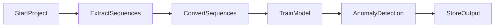

# ML 24/25-03 Implement Anomaly Detection Sample

## Introduction:

HTM (Hierarchical Temporal Memory) is a machine learning algorithm, which uses a hierarchical network of nodes to process time-series data in a distributed way. Each node, or column, can be trained to learn and recognize patterns in input data. This can be used in identifying anomalies/deviations from normal patterns. It is a promising approach for anomaly detection and prediction in a variety of applications. In our project, we are going to use the MultiSequenceLearning class in NeoCortex API to implement an anomaly detection system, such that numerical sequences are read from multiple CSV files inside a folder, train our HTM Engine, and use the trained engine for learning patterns and detect anomalies.  

## Requirements

To run this project, we need.
* [.NET 8.0 SDK](https://dotnet.microsoft.com/en-us/download/dotnet/8.0)
* Nuget package: [NeoCortexApi Version= 1.1.4](https://www.nuget.org/packages/NeoCortexApi/)

For code debugging, we recommend using Visual Studio IDE/Visual Studio Code. This project can be run on [github codespaces](https://github.com/features/codespaces) as well.

## Usage

To run this project, 

* Install .NET SDK. Then using the code editor/IDE of your choice, create a new console project and place all the C# codes inside your project folder. 
* Add/reference Nuget package NeoCortexApi v1.1.4 to this project.
* Place numerical sequence CSV Files (datasets) under relevant folders respectively. All the folders should be inside the project folder. More details are given below.

Our project is based on NeoCortex API. More details [here](https://github.com/ddobric/neocortexapi/blob/master/source/Documentation/gettingStarted.md).

## Working Process

Here is the working principle in a single graph to understand the steps to follow to execute and develop this project. [For more details click here]()



## Details

To train our HTM Engine, we used the [MultiSequenceLearning](https://github.com/ddobric/neocortexapi/blob/master/source/Samples/NeoCortexApiSample/MultisequenceLearning.cs) class in the NeoCortex API. Firstly, we will read and train the HTM Engine using the data from both our training (learning) and predicting (predictive) folders, which are present as numerical sequences in CSV files in the 'training' and 'predicting' folders inside the project directory. We will read numerical sequence data from the prediction folder for testing purposes, remove the first few elements (thus effectively turning the data into a subsequence of the original sequence; we have already inserted anomalies at random indexes into this data), and then use it to detect anomalies.

Please take note that all files inside the folders are read with the.csv extension, and exception handlers are set up in case the file format is incorrect.

We are employing artificial integer sequence data of network load for this project, which is saved inside of CSV files and is rounded off to the nearest integer, in percentage. Example of a csv file within training folder.

```
71,74,98,68,92,65,66,70,69,65
71,74,75,68,72,65,66,30,69,35
71,74,75,71,72,65,36,70,69,65
71,75,75,71,72,65,66,70,98,95
```
Normally, the values stay within the range of 65 to 75. All values outside of this range are considered anomalies for testing purposes. However, in order to identify anomalies, we have a csv file in the predicting folder. Typically, some of the data in this file does not fall within 65 and 75. 

```
69,72,75,68,72,67,66,99,72,67
69,72,75,68,72,67,66,90,69,97
69,74,75,68,72,67,66,92,68,100
69,74,75,68,72,67,66,10,68,85
68,74,75,68,72,67,16,50,69,65
71,74,75,68,72,97,66,70,69,85
```
We have uploaded the anomaly results of our data in this repository for reference.

output result of combined numerical sequence data from training folder (without anomalies) and predicting folder (with anomalies) can be found [here](https://github.com/almahamud1234/neocortexapi/tree/MatrixMasters/source/MySEProject/AnomalyDetectionSample/output)

   
### Encoding:

Encoding of our input data is very important, such that it can be processed by our HTM Engine. More on [this](https://github.com/ddobric/neocortexapi/blob/master/source/Documentation/Encoders.md). 

As we are going to train and test data between the range of integer values between 0-100 with no periodicity, we are using the following settings. Minimum and maximum values are set to 0 and 100 respectively, as we are expecting all the values to be in this range only. In other used cases, these values need to be changed.

```csharp

int inputBits = 121;
int numColumns = 1210;
.......................
.......................
double max = 100;

Dictionary<string, object> settings = new Dictionary<string, object>()
            {
                { "W", 21},
                ...........
                { "MinVal", 0.0},
                ...........
                { "MaxVal", max}
            };
 ```
 
 Complete settings:
 
 ```csharp

Dictionary<string, object> settings = new Dictionary<string, object>()
            {
                { "W", 21},
                { "N", inputBits},
                { "Radius", -1.0},
                { "MinVal", 0.0},
                { "Periodic", false},
                { "Name", "integer"},
                { "ClipInput", false},
                { "MaxVal", max}
            };
```

### HTM Configuration:

We have used the following configuration. More on [this](https://github.com/ddobric/neocortexapi/blob/master/source/Documentation/SpatialPooler.md#parameter-desription)

```csharp
{
                Random = new ThreadSafeRandom(42),

                CellsPerColumn = 25,
                GlobalInhibition = true,
                LocalAreaDensity = -1,
                NumActiveColumnsPerInhArea = 0.02 * numColumns,
                PotentialRadius = (int)(0.15 * inputBits),
                //InhibitionRadius = 15,

                MaxBoost = 10.0,
                DutyCyclePeriod = 25,
                MinPctOverlapDutyCycles = 0.75,
                MaxSynapsesPerSegment = (int)(0.02 * numColumns),

                ActivationThreshold = 15,
                ConnectedPermanence = 0.5,

                // Learning is slower than forgetting in this case.
                PermanenceDecrement = 0.25,
                PermanenceIncrement = 0.15,

                // Used by punishing of segments.
                PredictedSegmentDecrement = 0.1
};
```

### Multisequence learning

The [multisequencelearning](https://github.com/almahamud1234/neocortexapi/blob/MatrixMasters/source/MySEProject/AnomalyDetectionSample/multisequencelearning.cs) class file's [RunExperiment](https://github.com/almahamud1234/neocortexapi/blob/a05b009aaa68c6f3c7961583e2c247ee943d98a9/source/MySEProject/AnomalyDetectionSample/multisequencelearning.cs#L74) method provides an example of how multisequence learning functions. As a summary,

* The system initialization process begins with the initialization of connection memory and HTM configuration. Next, the HTM Classifier, Cortex Layer, and Homeostatic Plasticity Controller are initialized. 

* Finally, Temporal Memory and Spatial Pooler are set up to complete the initializatio

```csharp
.....
TemporalMemory tm = new TemporalMemory();
SpatialPoolerMT sp = new SpatialPoolerMT(hpc);
.....
```
* The cortical layer is then integrated with spatial pooler memory, which is trained for the maximum number of cycles.

```csharp
.....
layer1.HtmModules.Add("sp", sp);
int maxCycles = 3500;
for (int i = 0; i < maxCycles && isInStableState == false; i++)
.....
`````
* Temporal memory is then introduced to the cortical layer to learn every input sequence.

```csharp
.....
layer1.HtmModules.Add("tm", tm);
foreach (var sequenceKeyPair in sequences){
.....
}
.....
```
* The HTM classifier and trained cortical layer are finally returned. More [here](https://github.com/almahamud1234/neocortexapi/blob/a05b009aaa68c6f3c7961583e2c247ee943d98a9/source/MySEProject/AnomalyDetectionSample/multisequencelearning.cs#L298)


## Execution of the project


Our project is carried out as follows.
 

* At the beginning, we use the `ExtractSequencesFromFolder` method of the [`CsvSequenceFolder`](https://github.com/almahamud1234/neocortexapi/blob/MatrixMasters/source/MySEProject/AnomalyDetectionSample/CsvSequenceFolder.cs) class to read all files inside a folder. These classes maintain a list of numerical sequences from the read data for repeated future use. To handle non-numeric data, exception handling is incorporated within certain classes. Additionally, the `TrimSequences` technique allows data trimming by removing one to four components (numbers 1 through 4) from the start, returning a numeric sequence.

```csharp
 public List<List<double>> ExtractSequencesFromFolder()
        {
         ....  
          return folderSequences;
        }

public static List<List<double>> TrimSequences(List<List<double>> sequences)
        {
        ....
          return trimmedSequences;
        }
```

* Next, the `ConvertToHTMInput` method of the [`CSVToHTMInputConverter`](https://github.com/almahamud1234/neocortexapi/blob/MatrixMasters/source/MySEProject/AnomalyDetectionSample/CSVToHTMInputConverter.cs) class is used to convert all the read sequences into a format suitable for HTM training.

```csharp
Dictionary<string, List<double>> dictionary = new Dictionary<string, List<double>>();
for (int i = 0; i < sequences.Count; i++)
    {
     // Unique key created and added to dictionary for HTM Input                
     string key = "S" + (i + 1);
     List<double> value = sequences[i];
     dictionary.Add(key, value);
    }
     return dictionary;
```
After that, the `ExecuteHTMModelTraining` method of the [`HTMTrainingManager`](https://github.com/almahamud1234/neocortexapi/blob/MatrixMasters/source/MySEProject/AnomalyDetectionSample/HTMTrainingManager.cs) class is used to train the model using the converted sequences. The numerical data sequences from both the training (for learning) and predicting folders are combined before training the HTM engine. This class then returns the trained model object, which serves as the predictor.

```csharp
.....
MultiSequenceLearning learning = new MultiSequenceLearning();
predictor = learning.Run(htmInput);
.....
.....
List<List<double>> combinedSequences = new List<List<double>>(sequences1);
combinedSequences.AddRange(sequences2);
.....
```
In the end, we use the [`HTMAnomalyExperiment`](https://github.com/almahamud1234/neocortexapi/blob/MatrixMasters/source/MySEProject/AnomalyDetectionSample/HTMAnomalyExperiment.cs) class to detect anomalies in sequences read from files inside the predicting folder. All the previously explained classes—CSV file reading (using `CsvSequenceFolder`), combining and converting them for HTM training (using `CSVToHTMInputConverter`), and training the HTM engine (via `HTMTrainingManager`)—are utilized here. The same `CsvSequenceFolder` class is used to read files for the predicting sequences. The `TrimSequences` method is then applied to trim sequences for anomaly testing, as explained earlier.

```csharp
.....
var testSequences = LoadTestSequences(_testingDataPath);
string outputFilePath = PrepareOutputFile();
var (allTestingData, allAnomalyIndices, results) = DetectAnomalies(trainedPredictor, testSequences);
.....
```
The path to the training and predicting folders is set as the default and passed through the constructor, or it can be manually set within the class.

```csharp
.....
_trainingCSVFolderPath = Path.Combine(projectBaseDirectory, trainingFolderPath);
_predictingCSVFolderPath = Path.Combine(projectBaseDirectory, predictingFolderPath);
.....
```
In the end, the `DetectAnomaly` method is used to detect anomalies in our trimmed sequences one by one, utilizing the trained HTM model predictor.
 
```csharp
foreach (List<double> list in triminputtestseq)
       {
         .....
         double[] lst = list.ToArray();
         DetectAnomaly(myPredictor, lst);
       }
```
Exception handling is implemented to manage errors thrown by the `DetectAnomaly` method, such as passing non-numeric values or when the number of elements in the list is less than two.

The [`DetectAnomaly`](https://github.com/almahamud1234/neocortexapi/blob/a05b009aaa68c6f3c7961583e2c247ee943d98a9/source/MySEProject/AnomalyDetectionSample/HTMAnomalyExperiment.cs#L68) method, which is the main method of the `ExtractSequencesFromFolder` class, detects anomalies in our data. It traverses each value in the list one by one in a sliding window manner, using the trained model predictor to predict the next element for comparison. An anomaly score is used to quantify the comparison, and if the prediction exceeds a certain tolerance level, it is flagged as an anomaly.

We can obtain our prediction in a list of results in the format of `NeoCortexApi.Classifiers.ClassifierResult`1[System.String]` from our trained model predictor using the following method:

```csharp
var res = predictor.Predict(item);
```
We get the following output.
```
S2_2-9-10-7-11-8-1 - 100
S1_1-2-3-4-2-5-0 - 5
S1_-1.0-0-1-2-3-4 - 0
S1_-1.0-0-1-2-3-4-2 - 0
```
We know that the item we passed here is 8. The first line gives us the best prediction along with its similarity accuracy. By using basic string operations, we can easily extract the predicted value that will come after 8 (in this case, it is 1), and the previous value (which is 11 in this case). This allows us to retrieve the required values for further analysis or processing.
We will then use this to detect anomalies.

* When we iteratively pass values to the `DetectAnomaly` method using our sliding window approach, we won't be able to detect an anomaly in the first element. Therefore, at the beginning, we use the second element of the list to predict and compare it with the previous element (which is the first element). A flag is set to control the command execution: if the first element is detected as an anomaly, we will skip it and directly start from the second element. Otherwise, we begin the anomaly detection process from the first element as usual.

* Now, as we traverse the list one by one to the right, we pass each value to the predictor to get the next predicted value and compare it with the actual value. If an anomaly is detected, it is outputted to the user, and the anomalous element is skipped. Upon reaching the last element in the list, the traversal ends, and we move on to the next list for further processing.

We use anomalyscore (difference ratio) for comparison with our already preset threshold. When it exceeds, probable anomalies are found. [Code]()

To run this project, use the following class/methods given in [Program.cs].

```csharp
HTMAnomalyExperiment tester = new HTMAnomalyExperiment();
tester.ExecuteExperiment();
```
 
## Results

After running this project, we got the following [Output]()

We found Anomaly detection results for Testing the sequence: 54, 98, 48, 92,
45, 46, 50, 49, 45

FNR = FN / (FN + TP) = 0/ (0+2) = 0

FPR = FP / (FP + TN) = 2/ (2+5) = 0.29

Where, FN = 0, FP = 2, TN = 5, TP = 2.

After running our sample project, we analyzed the
rawOutput_20240324_230100.txt from output folder of this
experiment and got the following average results:

• Average FNR of the experiment: 0.22

• Average FPR of the experiment: 0.28

We can observe that the False Negative Rate(FNR) is in our output (0.22). It is desired that the false negative rate should be as lower as possible in an anomaly detection program. Lower false positive rate is also desirable, but not absolutely essential.

Although, it depends on a number of factors, like quantity (the more, the better) and quality of data, and hyperparameters used to tune and train model; more data should be used for training, and hyperparameters should be further tuned to find the most optimal setting for training to get the best results. We were using less amount of numerical sequences as data to demonstrate our sample project due to time and computational constraints, but that can be improved if we use better resources, like cloud.
